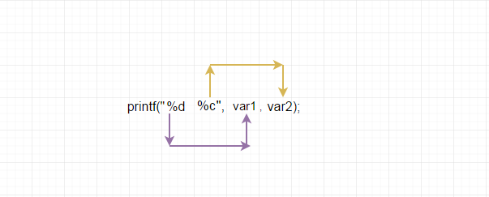

<div align="center">
  <a href="https://github.com/djedd1ne/Libft">
    
  </a>

  <h3 align="center">ft_printf</h3>
</div>

#### What is ft_printf?
This is a recreation of ```printf``` C function, using variadic methods to handle any number of arguments.<br>
``` bash
man stdarg
```
<br>
ft_printf can handle these placeholders: 
• %c Prints a single character.<br>
• %s Prints a string (as defined by the common C convention).<br>
• %p The void * pointer argument has to be printed in hexadecimal format.<br>
• %d Prints a decimal (base 10) number.<br>
• %i Prints an integer in base 10.<br>
• %u Prints an unsigned decimal (base 10) number.<br>
• %x Prints a number in hexadecimal (base 16) lowercase format.<br>
• %X Prints a number in hexadecimal (base 16) uppercase format.<br>
• %% Prints a percent sign.<br>

#### Usage
```
git clone https://github.com/djedd1ne/ft_printf.git
cd ft_printf && make
```
create a main.c and call ft_printf()
```C
#include "./includes/ft_printf.h"

int main() {
    int n = 10;
    ft_printf("%d\n", n);
}
```
Compile main.c with the libftprintf.a static library
``` bash
gcc -Wall -Werror -Wextra main.c libftprintf.a -o program
./program
```


